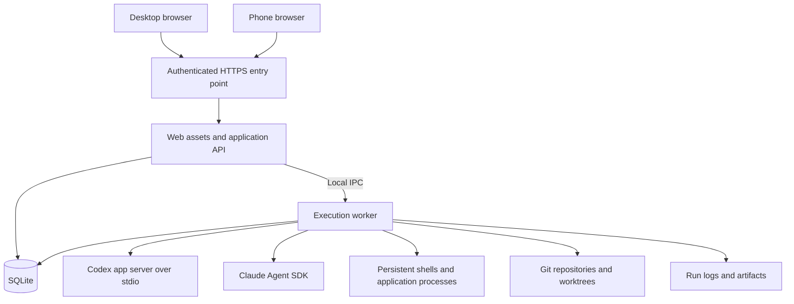

# Workbench phased implementation plan

Workbench will be a personal development platform on the existing EC2 instance. The browser will organize projects and feature workspaces, show readable Codex and Claude conversations, and control persistent shells, application processes, background jobs, and schedules. Desktop and phone will share execution state while using layouts suited to each device.

The recommended approach is a fresh repository with selective reuse from Canopy. Build one complete workflow with a real Codex session before adding the second agent or automation features. The execution worker, durable history, and reconnect behavior are part of that first workflow, because they are foundational to an always-on platform.

Prepared on October 4, 2026. All phases are pending. Technology choices below are proposed decisions unless described as an observed fact; Phase 0 must validate the integration assumptions.

## Product scope and success criteria

The application should support these everyday workflows:

- Open a project, create a workspace for a feature, and start an agent conversation in its own Git worktree.
- Read messages, inspect commands and file changes, respond to questions, and approve requested actions comfortably on a phone.
- Start work on desktop, close the browser, and continue observing or interacting from the phone.
- Run a shell or application server independently of an agent turn.
- Launch a background task and inspect its status, output, and artifacts later.
- Schedule recurring tasks and see each execution as a distinct run with a recorded outcome.
- Open a workspace in a desktop editor using the existing SSH development workflow.

The first usable release is complete when both agent providers work, workspaces and shell sessions persist, desktop and mobile reconnect correctly, and changes can be reviewed. The automation release adds durable background jobs and schedules. These are separate milestones so daily development can begin before automation is finished.

The initial scope is one trusted user and one EC2 machine. Defer multi-user collaboration, devbox provisioning, organization administration, GCP integration, Slack bots, and a plugin marketplace. Native mobile applications, a browser code editor, and a general workflow builder are also later work.

## What we learned from Canopy

The reference checkout is `/home/ubuntu/canopy`, inspected at commit `ea4f456`. Its architecture is documented in its [README](../canopy/README.md) and [AGENTS.md](../canopy/AGENTS.md). Canopy separates its web application, control service, and devbox agent; durable state flows through Postgres and Electric into TanStack DB.

That separation supports hosted infrastructure and multiple devboxes. Workbench can keep its API and execution worker on this machine, use a local database, and serve a smaller frontend. Copying the existing application wholesale would also copy its state synchronization and deployment assumptions.

| Reference | Reuse approach |
| --- | --- |
| [Design tokens](../canopy/apps/web/src/index.css) and [basic UI components](../canopy/apps/web/src/components/ui) | Port the useful colors, spacing, controls, and visual conventions. Record the origin of copied source and preserve applicable license notices. |
| [HomeSidebar](../canopy/apps/web/src/components/HomeSidebar.tsx) | Recreate its project and workspace hierarchy against Workbench data. Its existing component mixes navigation with devbox and database concerns. |
| [WorkspaceView](../canopy/apps/web/src/components/WorkspaceView.tsx) and [MobileNav](../canopy/apps/web/src/components/MobileNav.tsx) | Adapt the desktop panels, resizing, and mobile view switching. Replace agent terminals with conversation views. |
| [DiffView](../canopy/apps/web/src/components/DiffView.tsx) and [ChangeStack](../canopy/apps/web/src/components/ChangeStack.tsx) | Evaluate reuse for changed files and diffs. Defer Graphite and elaborate PR workflows. |
| [Workspace lifecycle notes](../canopy/apps/agent/src/workspaces/AGENTS.md) | Use as a reference for worktrees, stable paths, setup, environment ownership, archive, and restore. Port only the needed behavior. |
| [PTY manager](../canopy/apps/agent/src/pty/manager.ts) | Learn from persistent shell ownership and reattachment. Do not use a PTY as the primary agent conversation protocol. |
| [Automation lifecycle](../canopy/apps/agent/src/workspaces/automation-lifecycle.ts) | Preserve the principle that completions are correlated to the active run and late events cannot complete a different run. |

Keep a short provenance record when source is actually copied. Canopy includes an Apache 2.0 license; this plan does not copy its implementation into Workbench.

## Proposed technical architecture

Use TypeScript throughout, React and Vite for the frontend, Node.js for the API and worker, and SQLite for durable application state. A small HTTP framework such as Hono is a suitable default, subject to the integration spike. Use one package manager, a lockfile, and a pinned supported Node version. Node 24 is a starting candidate consistent with the reference project; verify library compatibility before pinning it.

Use HTTP for commands and server-sent events for agent activity, job updates, and execution state. Use a separate WebSocket channel for interactive shell bytes and terminal resizing. The API authenticates both channels and routes commands to the worker over local IPC. Neither provider process needs a public network listener.



Keep deployment small: an API service and a worker service supervised by systemd, plus an HTTPS entry point. Deploy from a known build rather than using a development file watcher in production. A worker restart is operationally more consequential than an API restart and must be handled separately.

The initial data storage layout should separate code from mutable state:

```text
Source checkout       /home/ubuntu/workbench
Application state     /home/ubuntu/.local/share/workbench
Managed repositories  /home/ubuntu/.local/share/workbench/repos
Feature worktrees     /home/ubuntu/.local/share/workbench/worktrees
Logs and artifacts    /home/ubuntu/.local/share/workbench/runs
```

These are proposed paths, not directories created by this plan. Allow explicit registration of an existing repository such as Canopy without moving it. Store configuration and runtime secrets outside Git. Choose durable storage and backups before claiming protection against EC2 replacement or disk loss.

### Repository structure

Scaffold this structure after Phase 0, with packages added only when they contain real shared code:

```text
apps/
  web/                 React views and browser state
  server/              Authenticated API, static assets, event delivery
  worker/              Provider sessions, Git, processes, jobs, scheduler
packages/
  contracts/           Validated commands, events, and shared types
  db/                  SQLite schema, migrations, and queries
docs/
  decisions/           Decisions with their evidence and tradeoffs
  operations/          Deployment, backup, restore, and recovery
```

Prefer one frontend application with shared components and device-specific layouts. Create separate native clients only if browser limitations become a demonstrated problem.

### Provider integration

Codex app-server is the proposed interactive integration. Its official documentation describes threads, turns, approvals, conversation history, and streamed events for custom clients. Use the local stdio transport; the documentation currently labels the command experimental. Pin the tested CLI version and generate protocol types from that version rather than assuming all future releases behave identically. [Codex app-server documentation](https://developers.openai.com/codex/app-server)

Claude Agent SDK is the proposed Claude integration. It runs the Claude Code binary with programmatic tools, sessions, permissions, and hooks. Verify authentication and project configuration explicitly: the documentation directs third-party product integrations to API-key authentication unless approved otherwise. Treat use of an existing personal CLI login as an unresolved question, not an assumed capability. [Claude Agent SDK documentation](https://code.claude.com/docs/en/agent-sdk/overview)

For Codex automation, evaluate the Codex SDK or structured noninteractive execution when Phase 7 requires it. The official SDK guidance distinguishes automation from app-server integrations for rich clients. Add another execution path only if it provides a concrete benefit and passes the same run-lifecycle checks. [Codex SDK documentation](https://learn.chatgpt.com/docs/codex-sdk)

Both providers feed a shared conversation view. Normalize messages, tool activity, questions, approval requests, errors, usage where available, and execution status. Retain provider session identifiers and bounded raw event records so provider-specific capabilities remain accessible. Do not force unsupported actions into a common API or fabricate provider internals.

### Data model and ownership

| Entity | Meaning and durable state |
| --- | --- |
| Project | A repository, display name, default base branch, and setup configuration. |
| Workspace | A feature branch and stable worktree path, lifecycle state, setup outcome, and process port reservations. |
| Conversation | A provider session belonging to a workspace, including the provider session identifier and display metadata. |
| Run | One execution attempt with timestamps, execution state, stop reason, ownership, and relevant provider or process identifiers. |
| Event | Ordered activity associated with a conversation or run, with a durable cursor and provider correlation identifiers. |
| Pending input | A question or approval tied to a particular live run and provider request. |
| Process session | A shell or application process with its working directory, lifecycle, output location, and reattachment metadata. |
| Job | An ad hoc or scheduled task with an execution definition, concurrency policy, and history of runs. |
| Schedule | A job trigger with expression, explicit timezone, next occurrence, and missed-run policy. |
| Artifact | A run-produced file with a stable identifier, display metadata, and retention policy. |

The worker owns execution. The API owns authentication and browser commands. SQLite owns durable application metadata and history. Provider-native session storage owns the context needed to resume its provider; browser history alone does not recreate that context.

Use database constraints for unique workspaces, schedule occurrences, and command idempotency keys. Give each browser mutation a request identifier so reconnects do not create duplicate workspaces or launch the same requested run twice. Persist a command before acknowledging acceptance, then let the worker claim it and execute it. An accepted command is different from a started or completed execution.

Configure SQLite for short transactions, migrations, busy handling, and the chosen journal mode. Keep full terminal logs and large artifacts in files, with database references. Persist agent activity before publishing the durable cursor; batch high-frequency deltas with a documented bound on potential crash loss. Store completed items as coherent records so history remains readable.

### Execution and reconnect semantics

Run states should cover `queued`, `starting`, `running`, `waiting_for_input`, `stopping`, and the terminal outcomes `succeeded`, `failed`, `cancelled`, and `interrupted`. Keep agent runs distinct from shell and application processes. A cancelled agent turn does not implicitly mean every independent workspace process has stopped.

- A browser disconnect only ends its subscription. It never owns the worker process or cancels a run.
- Reconnect loads a snapshot and replays ordered events after a cursor. Detect gaps and provide a fresh snapshot if retained events are no longer available.
- Handle the race between loading history and subscribing so events cannot disappear between the two operations. Support duplicate delivery without duplicate UI items.
- An API restart should leave the worker and its executions running. The API reconnects to the worker and resumes event delivery.
- A worker or provider crash may interrupt an active turn. Reconcile provider state and live processes before reporting an outcome. Never infer success from a dead process or resume every uncertain command automatically.
- Provider session resumption means conversation continuity, not guaranteed continuation of an in-flight operation. Expose an interrupted state when the outcome is uncertain.
- A machine reboot terminates in-memory execution. Restore metadata and provider history, identify interrupted attempts, and apply the job's explicit retry policy.
- Allow one active turn per provider session. Default to one mutating agent run per workspace; queue competing runs. Parallel feature work belongs in separate worktrees. Manual shells remain available but share that workspace's files.
- The first valid response to a pending question or approval wins across devices. Stale replies must fail clearly and must not affect a newer request.

## Desktop and mobile experience

Desktop keeps Canopy's project sidebar with nested workspaces. The main area provides conversation tabs and an optional changes or run panel. Multiple conversations can exist in a workspace without requiring every conversation to be running.

On mobile, show the current project and workspace in the header, a drawer for navigation, and full-screen Conversation, Changes, and Jobs views. Put Shell within the workspace's session selector so terminal controls do not dominate everyday agent use. Keep the message composer reachable while the keyboard is open.

Render agent messages as selectable, wrapping text with formatted code and links. Show commands, searches, and edits as expandable activity cards. Surface requested input near the composer and make it easy to find from other workspace views. Provide a jump to latest control when the reader has scrolled upward; new output should not force them to the bottom.

The same underlying events should support different presentations. Desktop can show side-by-side diffs and more activity details. Phone can default to stacked diffs, compact progress, and one task at a time. Persist execution and conversation state on the server; pane sizes, expanded cards, and similar presentation preferences can remain device-local.

Validate touch targets, keyboard behavior, safe-area spacing, viewport resizing, long file paths, large command output, screen reader labels, and real iOS Safari and Android browser behavior. Start with responsive browser access. Add installable PWA behavior later; cache application assets selectively and avoid caching authenticated API responses or pretending agent work runs offline.

## Milestones and dependencies

| Milestone | Phases | What becomes usable |
| --- | --- | --- |
| Integration proven | 0 | Demonstrated provider interfaces and process behavior, with decisions recorded. |
| Codex development workflow | 1 through 3 | Authenticated desktop and mobile app, workspaces, real Codex, durable history, and browser reconnect. |
| Daily development release | 4 through 6 | Both agents, changes, persistent shells, application processes, previews, and desktop editor handoff. |
| Automation release | 7 and 8 | Durable jobs, artifacts, schedules, and explicit recovery behavior. |
| Operational release | 9 | Tested deployment, backups, restoration, upgrades, and operational limits. |

Operational work begins in Phase 1 and is exercised in every phase. Phase 9 verifies the complete system; it is not the first time authentication or recovery is implemented. Complete each phase's exit criteria before expanding scope. Build the real backend path as soon as the relevant UI is usable, rather than completing a large mock application first.

## Phase 0 Validate integrations and record decisions

**Objective:** Resolve the integration questions that could invalidate the architecture before building the UI around them.

Observed environment: Codex CLI `0.160.0` and Claude Code `2.1.289` are installed. Git and systemctl are available. Node.js, npm, Bun, mise, and Docker were not found on the shell PATH used for the inspection. This is a PATH observation, not proof that no other runtime installation exists.

Work:

- Inventory runtime tooling, persistent storage, available memory and disk, and the existing SSH workflow. Choose and install the application runtime without replacing the working agent installations unexpectedly.
- In a disposable test repository, drive one Codex session through app-server: initialize, start, stream, ask for input or approval, interrupt, and resume. Record the actual protocol and supported methods for the installed version.
- Drive an equivalent Claude SDK session and verify the supported authentication method and billing path. Check configuration loading for project instructions, skills, and MCP where needed.
- Test browser-independent execution with a small event consumer, not a terminal output parser. Confirm what happens when the consumer disconnects and when the provider process terminates.
- Evaluate persistent shell ownership, choosing a proven multiplexer or equivalent supervised process mechanism. Canopy's zmx design is a reference; validate availability before choosing it.
- Choose the first access method. Private HTTPS through a VPN is a reasonable default for this personal platform; a public domain behind authentication is an alternative. Record the choice before external exposure.
- Record runtime, provider versions, auth approach, process supervision, initial storage paths, and any integration limitations in short decision documents.

Deliverables: small integration probes, sample redacted events, a capability matrix, and concrete architecture decisions. Keep test repositories and credentials outside committed source.

Exit criteria:

- [ ] Both providers can run a small real task and resume their conversation, or a specific supported alternative and its limitations are documented.
- [ ] Question, approval, cancellation, error, and restart behavior are demonstrated rather than inferred.
- [ ] The tested runtime and provider versions can be reproduced.
- [ ] An access approach and durable state location are selected.

If a provider lacks a required interactive capability, resolve that limitation before promising UI support. Codex can still proceed first if Claude authentication requires a later decision; the Claude integration phase remains explicitly pending.

## Phase 1 Establish the application foundation

**Objective:** Create a small authenticated application and a worker that exists independently of browser requests.

Work:

- Scaffold the web, server, worker, contracts, and database code with the runtime selected in Phase 0. Add formatting, type checking, meaningful test commands, and a production build.
- Set up versioned migrations and the initial project, workspace, conversation, run, command, and event tables. Add jobs and schedules when those features are built.
- Implement local worker IPC, durable command acceptance, worker command claiming, and basic readiness reporting. Establish the event cursor and reconnect protocol now.
- Add the chosen access boundary and application session behavior. Validate origin and session checks for mutations and streaming connections. Keep provider processes reachable only from the worker.
- Create separate API and worker systemd service definitions. Choose service privileges and file ownership compatible with the actual personal development workflow and provider authentication.
- Add structured service logs, configurable storage paths, graceful shutdown behavior, and an initial database backup procedure.
- Provide `.env.example` with configuration names and placeholders only. Do not copy existing credential files into this repository.

Deliverables: authenticated empty app, database migrations, worker command plumbing, development commands, service definitions, and a short setup guide.

Exit criteria:

- [ ] The app loads on desktop and phone through the selected access method.
- [ ] Unauthenticated browser requests cannot invoke commands or subscribe to execution streams.
- [ ] The API can restart while the worker stays running.
- [ ] Repeated submission with one idempotency key produces one durable command.
- [ ] An empty database migrates successfully and a backup can be restored into a disposable location.

## Phase 2 Implement projects and feature workspaces

**Objective:** Make the Canopy navigation model functional on the single machine.

Work:

- Build the sidebar, project groups, nested workspace rows, current workspace header, and mobile drawer. Port useful Canopy visual tokens and basic controls.
- Support registering an existing repository first. Add managed cloning once the existing-repository path works. Discover its base branch and require an explicit selection if discovery is ambiguous.
- Create each feature workspace as a new branch and stable Git worktree path. Serialize repository mutations and handle partial failures with visible setup state and recoverable cleanup.
- Persist workspace identity, name, branch, and path. Separate pending creation, setup failure, ready, and archived states.
- Support an optional project setup command with recorded output and outcome. Keep agent authentication variables separate from project application environment variables.
- Implement workspace renaming and search. Preserve dirty or untracked work when archiving; use a tested checkpoint or retain the worktree until safe restoration is proven. Never silently discard changes.
- Prepare the conversation view and composer. Use fixtures briefly for visual development, then connect to the real execution path in Phase 3.

Deliverables: functional project navigation, worktree creation, setup output, workspace lifecycle controls, and responsive app structure.

Exit criteria:

- [ ] Two workspaces in one project have independent branches and working directories.
- [ ] Creating a workspace twice through a reconnect does not create duplicate branches or worktrees.
- [ ] Setup failure is visible and can be retried without losing workspace identity.
- [ ] Archive and restore preserve tracked and untracked work under the chosen policy.
- [ ] Project and workspace selection works from a narrow phone viewport.

## Phase 3 Build the first real Codex workflow

**Objective:** Complete the first useful end-to-end milestone with rich conversations and durable reconnect.

Work:

- Connect the worker to the tested app-server protocol. Persist provider thread identifiers and the association between workspace, conversation, turn, and run.
- Stream user messages, agent messages, command activity, edit activity, completion, and errors into the application event model. Correlate started and completed tool items.
- Implement message submission, follow-up turns, cancellation, conversation reopening, and supported input or approval requests. Show an explicit explanation for unsupported actions.
- Render readable activity cards and expandable output. Keep authoritative Git diffs separate from an agent's description of its edits.
- Persist completed history, paginate older items, and implement cursor replay for reconnect. Show live connection state and distinguish it from run state.
- Prevent concurrent turns in the same session and competing mutating agent runs in the same worktree. Enforce this in the worker, not only with disabled browser buttons.
- Exercise mobile message composition, long output, scrolling, pending approvals, and switching workspaces during an active run.

Deliverables: a real Codex conversation UI, working controls, recorded run outcomes, and a small regression suite for provider event mapping and reconnect.

Exit criteria:

- [ ] Create a feature workspace, ask Codex for a small code change, and inspect its activity.
- [ ] Close the desktop browser during execution; the run continues and appears correctly on the phone.
- [ ] Reopen history without duplicate messages or missing completion events.
- [ ] A question or approval can be answered once from either device; a stale second response is rejected.
- [ ] Cancellation reaches the intended turn, and a follow-up prompt continues the correct conversation.
- [ ] Provider failure becomes a visible failed or interrupted run with retained history.

This is the first milestone to use personally. Do not postpone it until the automation system is complete.

## Phase 4 Add Claude through the shared conversation UI

**Objective:** Support the second agent without duplicating the application or hiding its differences.

Work:

- Integrate the validated Claude SDK authentication and session mechanism. Keep provider credentials server-side.
- Map Claude messages, tool calls, results, pending input, errors, and session identifiers into the existing conversation model.
- Show provider selection when creating a conversation, with model choices based on demonstrated availability. A workspace may have both providers, but each conversation has its own provider context.
- Make capabilities explicit: interruption, steering, attachments, model configuration, and approval controls should appear only when supported and verified.
- Verify project instruction and tool configuration loading. Do not assume SDK defaults match an interactive CLI invocation.
- Reuse the browser controls and history renderer; add provider-specific detail panels only where useful.

Deliverables: Claude integration, provider selection, capability-aware controls, and equivalent lifecycle verification.

Exit criteria:

- [ ] Claude completes a small workspace task through the web app.
- [ ] Disconnect, reopen, approval or question handling, cancellation, and provider failure pass the same applicable scenarios as Codex.
- [ ] Switching between Claude and Codex conversations preserves each provider's history and context.
- [ ] Authentication requirements and costs are clear in setup documentation.

## Phase 5 Add changes and persistent shell sessions

**Objective:** Make the application sufficient for inspecting and debugging agent work.

Work:

- Implement Git status and lazy diff retrieval, including staged, unstaged, and untracked files. Handle binary files and large diffs with clear bounded previews.
- Adapt the useful Canopy diff UI to desktop side-by-side and phone stacked layouts. Track the branch and refresh version so stale diffs do not appear as current.
- Add persistent shell sessions using the Phase 0 process mechanism, a browser terminal, reattachment, resizing, and bounded replay.
- Treat shell detach and shell termination as separate operations. Preserve the underlying shell through browser and API restarts.
- Provide mobile shell input and necessary key controls. Keep it accessible without making terminal interaction the default agent experience.
- Add a workspace path action and editor handoff compatible with the user's configured desktop SSH workflow. Test from the actual client before documenting it as working.

Deliverables: changed-file list, diff viewer, persistent shells, and remote editor handoff.

Exit criteria:

- [ ] The user can inspect an agent's actual changes from desktop and phone.
- [ ] A long-running shell command continues after the browser closes and can be reattached.
- [ ] Terminal output, resizing, and explicit termination work across supported devices.
- [ ] Large output and diffs remain bounded and do not freeze mobile navigation.
- [ ] Git state remains correct after shell edits, an agent edit, and a branch change.

## Phase 6 Add application processes and previews

**Objective:** Run and inspect project applications alongside development conversations.

Work:

- Add explicit start and stop controls for a project's development command, with independent process status and logs.
- Persist workspace port reservations and validate availability at process launch. Handle collisions visibly rather than claiming a database reservation guarantees a successful bind.
- Support a simple project configuration for setup, run command, named ports, and preview targets. Reuse Canopy configuration concepts where they help, while keeping the schema small.
- Route registered preview targets through the selected access layer. Restrict proxy targets to owned local application processes; do not expose an arbitrary URL proxy.
- Test development server WebSocket upgrades, path handling, and cookie behavior. Use separate preview origins where needed to keep application sessions separate from platform sessions.
- Keep application processes alive when an agent finishes and when the API restarts. Record and reconcile them independently after worker restarts.

Deliverables: Run panel, application log view, preview links, process controls, and project command configuration.

Exit criteria:

- [ ] Run a real project app and open its preview on desktop and phone.
- [ ] Two workspaces can run without accidentally sharing the same port reservation.
- [ ] A failed start or occupied port shows a useful error and supports retry.
- [ ] Stopping an agent does not implicitly stop the independent application server.
- [ ] Preview requests and development WebSockets work through the chosen access method.

Phases 1 through 6 constitute the daily development release.

## Phase 7 Implement durable background jobs

**Objective:** Run tasks independently of active browser conversations and record their outcomes.

Work:

- Add job definitions for shell commands and supported agent tasks. Let each job choose an existing workspace or a new isolated worktree, with explicit cleanup rules.
- Persist the queue, worker claims, run attempts, ownership leases, and stop requests. Reconcile uncertain runs against real processes and provider state before reclaiming them.
- Implement manual launch, queued cancellation, active cancellation, timeout, bounded concurrency, and retry policy. Reuse execution primitives from conversations rather than building a separate task engine.
- Keep retry attempts distinct. Do not automatically retry a potentially mutating task with an unknown outcome unless its policy makes that safe.
- Capture stdout, stderr where available, exit codes, provider errors, final agent responses, and artifacts. Show partial output after failure.
- Set disk retention and output limits. Add cleanup that excludes active runs and pinned artifacts.
- Treat noninteractive approval requirements explicitly. A job may wait for user input or fail under its configured policy; it must not sit indefinitely with no visible state.
- Add a Jobs view with filters for running, waiting, finished, and failed work.

Deliverables: durable queue, job controls, execution history, artifact access, and retry configuration.

Exit criteria:

- [ ] A job continues after all browser sessions close.
- [ ] Competing workers or restarts cannot claim the same queued attempt simultaneously.
- [ ] A killed worker yields a visible, reconciled outcome; it does not produce a false success or silently duplicate work.
- [ ] Failed tasks retain logs and artifacts, and a manual retry creates a new recorded attempt.
- [ ] Limits prevent one noisy task from exhausting the application's output storage.

## Phase 8 Add schedules and notifications

**Objective:** Trigger jobs reliably at known times and make results easy to find.

Work:

- Add cron-style schedules with an explicit timezone and a preview of upcoming occurrences. Default to UTC until the user selects another timezone.
- Persist the next occurrence, an occurrence identifier, and the policy for missed executions. Default to skipping missed occurrences after downtime rather than creating a surprise backlog.
- Atomically create one run per scheduled occurrence. Use a unique database constraint and transactional claim so restart or overlapping ticks cannot duplicate enqueueing.
- Define an overlap policy per job. Default to skipping a new occurrence while the previous run is active, with the skipped occurrence visible in history.
- Add pause, resume, and manual run controls. Document daylight saving behavior for non-UTC schedules and verify the scheduler library's actual semantics.
- Start with in-app unread results and waiting-input indicators. Add browser push only after its support and subscription behavior are demonstrated on the target devices.
- Add external notification channels only when requested and configured. Do not send messages to third-party services as part of initial setup.

Deliverables: schedule editor, next-run display, execution history, and in-app notifications.

Exit criteria:

- [ ] A schedule enqueues one run for one occurrence, including across a scheduler restart.
- [ ] Downtime, overlap, timezone changes, and daylight saving cases follow the documented policy.
- [ ] Pause stops future triggers while leaving existing run behavior explicit.
- [ ] Completed and waiting-input runs are easy to find from a phone.

The scheduler should aim for one enqueue per occurrence, not claim exactly-once execution of external side effects. Tasks may fail after partially changing files or other systems.

## Phase 9 Validate operations and release for ongoing use

**Objective:** Make deployment, recovery, and routine upgrades predictable.

Work:

- Finalize HTTPS, access controls, service configuration, environment ownership, startup order, and readiness behavior. Diagnose worker unavailability separately from an empty project list.
- Establish a deployment procedure that drains or deliberately interrupts runs before worker upgrades. Preserve access to the prior application build and compatible database backup.
- Pin provider versions and rerun their contract checks before upgrades. Schema migrations require a tested rollback or restore approach; changing the application binary alone may not undo a migration.
- Use a consistent SQLite backup method. Back up workspace metadata, required worktree changes, logs or artifacts under retention policy, and provider state needed for resumption. Treat Gitignored project configuration and credentials according to their separate recovery policies.
- Test restoration to a separate directory or machine. Document what is restored, what needs reauthentication, and which interrupted tasks require manual review.
- Monitor disk, memory, event-loop pressure, job duration, queue age, and provider failures. Surface actionable failures in the app and record detailed service diagnostics.
- Run the acceptance matrix below, then use the platform for real feature work and several scheduled executions. Fix observed problems before adding optional extensions.

Deliverables: deployment runbook, service units, backup and restore procedures, upgrade procedure, limits, and a tested acceptance record.

Exit criteria:

- [ ] API restart, worker crash, provider failure, machine reboot, and low-disk scenarios have documented and demonstrated outcomes.
- [ ] Backup restoration recovers project and conversation navigation plus the intended development state.
- [ ] An application or provider upgrade can be performed without silent run duplication or missing history.
- [ ] Real desktop and phone usage passes the complete acceptance matrix.

## Verification strategy

Test the boundaries where state crosses processes or survives failures. Use small provider-event fixtures for mapping and real-provider smoke tests for installed protocol compatibility. Real provider tests consume account resources, so run them deliberately during integration and upgrades rather than on every formatting change.

Database and worker tests should cover idempotent commands, concurrent claims, event replay ordering, stale approval replies, worktree creation failures, run reconciliation, cancellation, and scheduled occurrence uniqueness. Browser tests should cover navigation, reconnect, pending input, pagination, and mobile composition. Do not rely on frontend mocks to prove an agent integration works.

| Scenario | Expected outcome |
| --- | --- |
| Close browser during an agent turn | Worker continues; another device observes the same run. |
| Reconnect during message streaming | History and live events join without omissions or duplicate items. |
| Restart API during a shell command | Persistent session continues and can be reattached. |
| Crash worker during an agent edit | Run is reconciled or marked interrupted; no assumed success or blind replay. |
| Submit the same command twice | One accepted command and intended execution are created. |
| Answer an approval from two devices | One response wins; the other reports a stale request. |
| Launch two mutating agents in one workspace | Worker enforces the configured queue or conflict policy. |
| Archive dirty workspace | Edits and untracked files survive under the documented preservation policy. |
| Start two application workspaces | Port allocation and preview routing remain independent. |
| Stream very large output on phone | Output is bounded or paginated; navigation and composer remain usable. |
| Restart scheduler near a due time | One occurrence is enqueued according to the missed-run policy. |
| Reboot machine mid-job | Attempt is recoverable or visibly interrupted; retries obey the job policy. |
| Restore backup into a clean location | Durable metadata and the promised development state can be recovered. |

## Decisions to resolve during implementation

| Decision | Default proposal | Resolve by |
| --- | --- | --- |
| Project name | Workbench as a working name | Before public branding or remote repository creation. |
| Access from phone | Private HTTPS access through a VPN | Phase 0, before external access. |
| Claude authentication | Use a supported SDK authentication path; verify account setup | Phase 0 and before Phase 4. |
| Runtime and package manager | Pinned Node runtime and one package manager | Phase 0. |
| Shell persistence | Proven local multiplexer or supervised equivalent | Phase 0. |
| Workspace archive | Preserve the worktree or implement verified checkpoint and restore | Phase 2. |
| Preview origins | Separate origins when project cookie or path behavior requires them | Phase 6. |
| Agent automation interface | Reuse the interactive adapter unless a tested SDK path provides a benefit | Phase 7. |
| Schedule timezone | UTC | Phase 8; editable per schedule. |
| Retention and backup targets | Bounded local history plus separately stored backups | Initial policy in Phase 1; finalized in Phase 9. |

Resolve routine implementation choices using the evidence from the current phase. Request user input when a missing preference materially changes account billing, access setup, data retention, or the intended workflow. Avoid turning every technical choice into a permission step.

## Extension points after the first releases

Once daily use is reliable, consider prompt presets, richer planning views, conversation search, workspace templates, attachment handling, browser push, PR creation, and additional job triggers. Add each against the shared event and execution model so it serves both desktop and mobile.

Only consider multiple machines, Postgres, or a more elaborate orchestration system after measured workload or collaboration needs justify them. SQLite and the single worker are the intended initial operating model, not placeholders for a mandatory future rewrite.

## First implementation tasks

1. Start Phase 0 by validating runtime installation and the exact Codex app-server protocol available on this instance.
2. Run a minimal session in a disposable Git worktree and capture messages, tool events, cancellation, and resumption behavior.
3. Verify Claude SDK authentication and lifecycle, and choose the persistent shell mechanism.
4. Record the decisions, then scaffold the Phase 1 application and durable command and event path.
5. Build project navigation and workspace creation, then complete the Phase 3 desktop-to-phone Codex workflow.

The critical path is proven provider integration, durable execution, stable workspaces, and readable reconnecting conversations. Finish that path before expanding into schedules or optional platform features.
